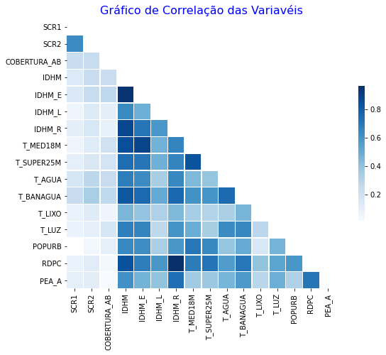

# OPEN DATA DAY 2021
 

 
__Análise exploratória do evento Open Data Day 2021 organizado pela comunidade [Py013](https://github.com/Py013/Open-Data-Day-2021).__
 
<br>
 
# Análise Final
 
[__Assistam  o vídeo da apresentação dessa análise!__](https://www.youtube.com/watch?v=slNPg58SHzQ&t=2200s)
 
[__Leiam o post no Medium sobre o evento!__](https://lucasmbribeiro.medium.com/dbdb9df11ab?source=friends_link&sk=6ca07982a894c859d5510657df9357c2)
 
<br>
 
## Estrutura da pasta e Arquivos
 
__Apresentação do YouTube:__ Contém os arquivos da apresentação "Oficina do Dataset" do dia 26/02/2021 no Youtube.
<br> __base:__ Dataset das vacinas e cidades.
<br> __imagens:__ Imagens do projeto.
<br> __AED_Final.ipynb:__ Análise final do estudo do Dataset.
<br> __funcoes_aed.py:__ Funções de tratativas do Dataframe.
<br> __Open Data Day 2021.pdf:__ PPT da apresentação final do evento.
 
<br>
 
__Problema que me propus a analisar:__
<br>Quais variáveis ajudam a aumentar a cobertura da segunda dose?
 
<br>
 
_Características do Dataset:__
* Vacina: Sarampo, Caxumba e Rubéola.
* Região: Norte do Brasil.
* Ano: 2016, 2017 e 2018
* O dataset está em nível de município e não em indivíduo.
 
## Resultados encontrados
 
Analisando a correlação entre as variáveis, encontrei um conjunto de variáveis que poderiam me ajudar a responder a pergunta principal.
```
['SCR1', 'SCR2', 'COBERTURA_AB', 'IDHM', 'IDHM_E', 'IDHM_L', 'IDHM_R', 'T_MED18M', 'T_SUPER25M', 'T_AGUA'
 , 'T_BANAGUA', 'T_LIXO', 'T_LUZ', 'POPURB', 'RDPC', 'PEA_A']
 ``` 
 
 
 
 <br>
 
 Com isso encontrei dois grandes grupos __Índice de Desenvolvimento Humano__ & __Variáveis Socioeconômicas__.
 <br> Que são subdivididos em três áreas: __Educação__, __Longevidade__ e __Renda__.
 
 
 
 Fui explorar uma variável de cada um dos três grupos.
 
 ## Educação
_% população com 18 anos ou mais com médio completo_
 
 
 
 Temos uma concentração entre 15% à 25% dos membros da familía com o ensino médico completo __X__ Uma cobertura vacinal entre 50% à 75%.
 <br> Pontos que me chamaram atenção:
 * O Estado do Tocantins mostra uma constância entre 15% a 25% da população.
* O Estado do Pará tem quase uma linha na casa dos 20% pra baixo e uma concentração até 75% 
 
 ## Longevidade
_% da população em domicílios com banheiro e água encanada_
 
 
 
Claramente o gráfico apresenta uma ótima correlação entre saneamento básico __X__ cobertura vacinal. Quanto maior a cobertura do saneamento, maior tende ser a cobertura vacinal.
 
 ## Renda
 _Renda Domiciliar per capita_
 
Split da Renda per Capita
|Média|Min|25%|50%|75%|Max|
|:---:|:---:|:---:|:---:|:---:|:---:|
|R$ 343,19|R$ 121,32|R$ 237,28|R$ 319,42|R$ 411,25|R$ 1.087,34|
 
Analisando os dados de renda, dois pontos trouxeram atenção:
* A baixa renda da região norte.
* A possibilidade de aumentar a cobertura, tendo pelo menos uma renda próxima ao salário mínimo.
 


 
Split do Salário Mínimo no Brasil
|2016|2017|2018|
|:---:|:---:|:---:|
|R$ 880|R$ 937|R$ 954|
 
A Atenção fica onde tem o __X__ na possibilidade de aumentar a renda da região para aumentar a concentração próxima aos 100% de cobertura.
 

 
## Conclusão
* É uma análise inicial para trazer um indicador de onde podemos iniciar uma melhor exploração.
* Dado essa primeira análise, podemos pensar em alavancas para as variáveis indicadas e com isso 
talvez resulte no  aumento da cobertura da segunda dose.
* Renda e Longevidade me trouxe uma grande certeza que se aumentarmos a qualidade desses indicadores, podem trazer uma melhor cobertura. 
 
## Próximos Passos
* Validar a análise inicial realizada.
* Explorar as demais variáveis do Dataset.
* Acompanhar a evolução das variáveis.
* Analisar uma região mais especificamente. 
