# Python + Google Sheet + Pandas
 
## __Nesse guia você irá aprender:__
1. Como criar um projeto no Google Developer.
2. Ativar as API do Google Sheets e Drive
3. Criar credenciais de autenticação e o motivo de cada uma.
4. Compartilhar a planilha com e-mails de serviço.
5. Codificar em Python metodos para: ler, criar e atualizar sua planilha no Google Sheets. 
 
 

 
# __Preparando seu ambiente__
 
> Esse passo a passo é __obrigatório__ pois vamos criar um projeto no painel do google developers e ativar a API do Google Sheets. Sem isso, nada funciona.
 
## Criar um projeto no Google Developer Console
 
Link: https://console.developers.google.com/project
> Clique na opção + Criar Projeto<br>
 

 
 > Defina um nome para o seu projeto
 
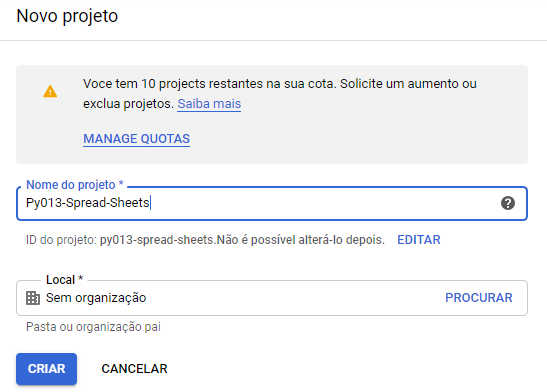
 
# __Ativado as API's__
 
## Ativando Google Sheets API
 Com nosso projeto criado, vamos habilitar a API.
 
 > Na barra de pesquisa, digite: Google Sheets API
 

 
 > Seleciona a opção __Ativar__
 

 
## Configurando o consentimento OAuth
 Precisamos definir se nossa autenticação será __Interna__ _(Apenas para usuários da organização do seu projeto)_ ou __Externa__ _(Abrange todo mundo)_.
 
> Nesse exemplo eu selecionei a opção __Externa__
 
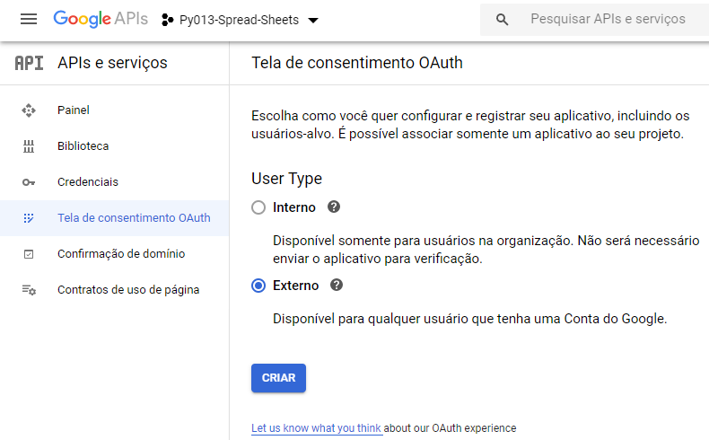
 
> Precisamos definir um nome para o aplicativo. _Assim iremos sabem onde está sendo feito a autenticação_
 
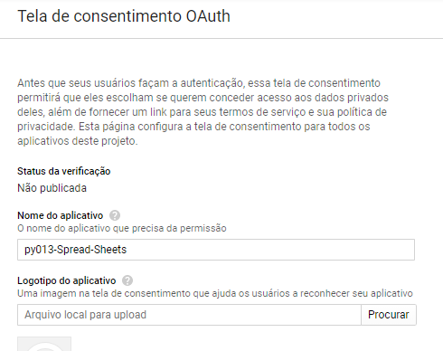
 
 
## Ativando a API do Google Drive
 
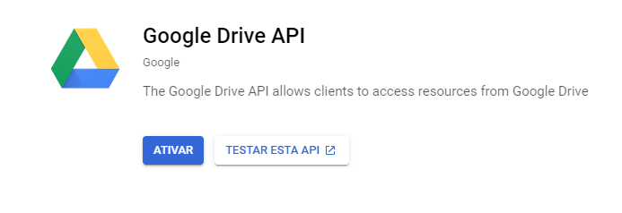
 
---
 
# __Credenciais__
 
## Credencial para conta OAuth
> Na página inicial do nosso projeto, clique em __credenciais__, __+ Criar Credenciais__ e selecione __ID Cliente OAuth__
 
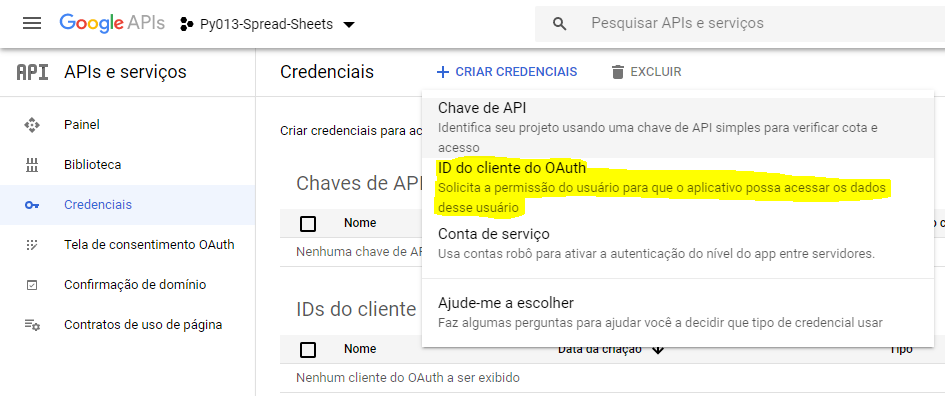
 
> Selecione a opção do dispositivo que irá fazer a autenticação, no nosso caso: __App para computador__ 
 
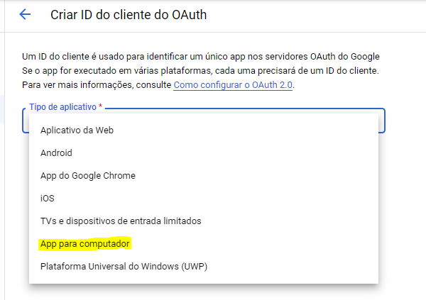
 
> Faça o download do seu arquivo com as credenciais. <br>
> Coloque seu arquivo .json na pasta do seu projeto! Você pode renomear seu arquivo.
 
## Credencial para conta de serviço
> Aqui selecionamos o opção: __Conta de Serviço__
 
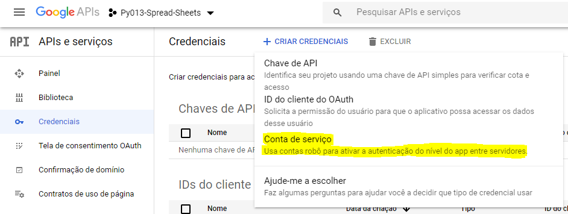
 
> Precisamos dar um nome nossa chave
 
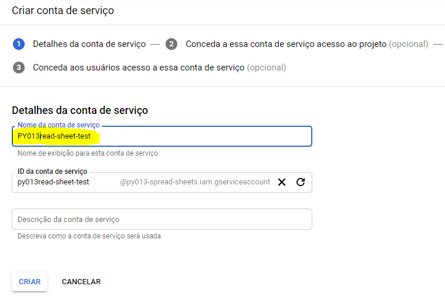
 
> Os demais passos não são obrigatórios, então podemos pular. 
 
 <br>
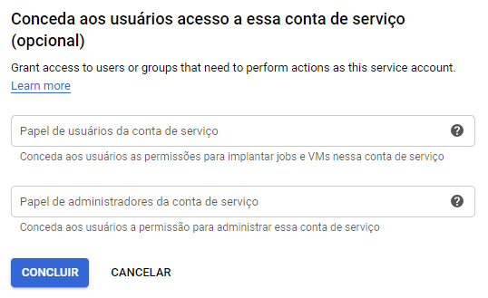
 
> __Credencial criada com sucesso__
 
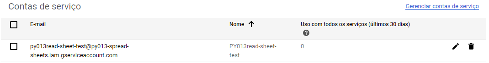
 
## 2. Criar uma key de autenticação
 
> Clicando na credencial que criamos, vamos na opção __Chaves__.
 
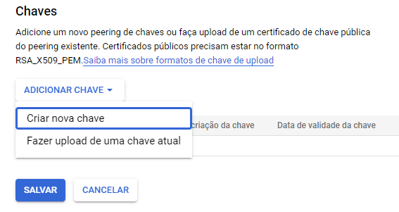
 
> Eu indico criar no formato ```.json``` 
 
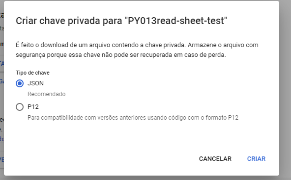
 
> Chave criada, será feito um download da chave. <br> 
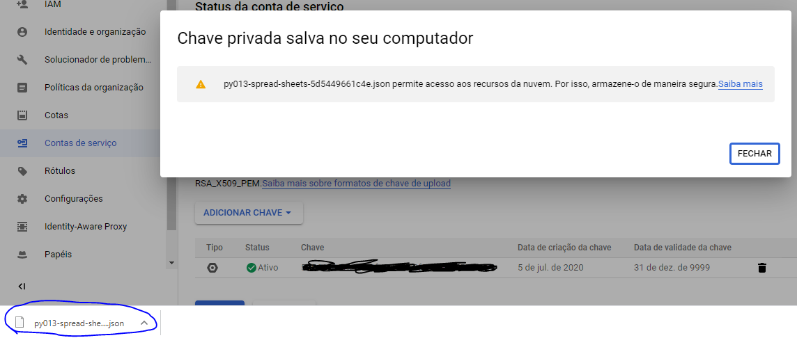
 
---
 
# __Google Sheets__
 
1. __Id da Planilha do Google Sheets__
<br>Armazene essa chave, pois vamos precisar em nosso código.
 
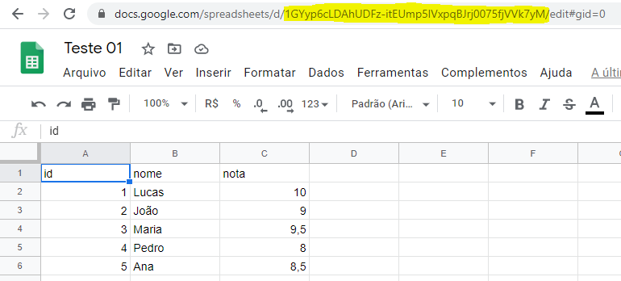
 
## Acesso ao e-mail de serviço 
_Esse passo só obrigatório, caso utilizei a autenticação por conta de serviço_
 
Precisamos conceder acesso ao e-mail criado na planilha queremos acessar. _Em nossa credencial criada, foi gerado um e-mail._
 
> Pegamos o e-mail criado na conta de serviço.
 
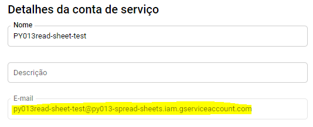
 
> Na planilha, adicionamos o e-mail.
 
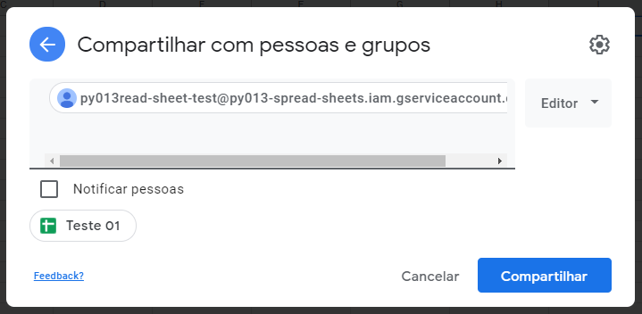
 
---
 
 # __Python__
 
 Desenvolvi 4 notebooks para aprendermos as funcionalidades.
 
 __01_GS.ipynb__
 <br> Script criado pelo Google para testarmos nossas chaves e projeto criado. Nesse exemplo usamos as chaves de autenticação local.
 
 __02_GS.ipynb__
 <br> Faço uma adaptação no script para lermos uma planilha de nossa escolha e o retorno é um DataFrame Pandas. Nesse exemplo usamos as chaves de autenticação local.
 
 __03_GS.ipynb__
 <br> Um novo código construído para realizar a autenticação com uma conta de serviço. Para executar esse script é __necessário ter uma credencial de serviço__.
 
 __04_GS.ipynb__
 <br> Tendo como base o exemplo 3, construímos um script mais dinâmico para: __autenticar__, __ler__, __atualizar__ e __criar__ nova planilha. É necessário ter uma credencial de serviço.
 
 ## Bibliotecas necessárias para instalação
 
 ```
 pip install --upgrade google-api-python-client google-auth-httplib2 google-auth-oauthlib 
 
 pip install gspread
 ```
 
---
 
# __Referências__
 
## Links das bibliotecas
* https://google-auth.readthedocs.io/en/latest/reference/google.oauth2.service_account.html
* https://gspread.readthedocs.io/en/latest/index.html
* https://pandas.pydata.org/pandas-docs/stable/index.html
 
 ## Links para as funções
 * https://gspread.readthedocs.io/en/latest/oauth2.html#for-bots-using-service-account
 * https://gspread.readthedocs.io/en/latest/user-guide.html?#getting-all-values-from-a-row-or-a-column
* https://gspread.readthedocs.io/en/latest/user-guide.html?#getting-a-cell-value
* https://gspread.readthedocs.io/en/latest/user-guide.html?#updating-cells
*  https://gspread.readthedocs.io/en/latest/user-guide.html?#creating-a-worksheet

