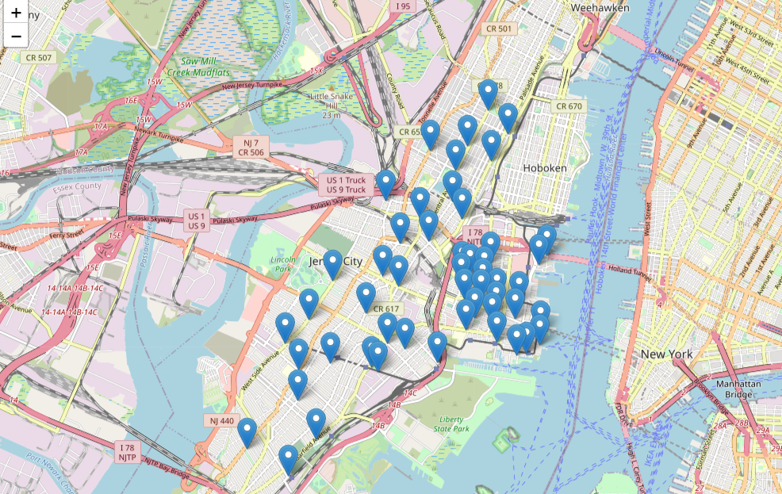
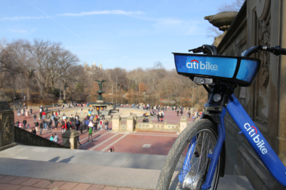

# Introdução a Biblioteca Pandas 🐼

# 1. Contexto
Devido ao Coronavírus, surgiu a ideia na comunidade da [Py013](https://github.com/Py013) em realizarmos algumas palestras de forma online e disseminar o conhecimento em Python com um foco em análise de dados.

# 2. Objetivo
Esse projeto tem como objetivo compartilhar uma introdução ao pandas possibilitando um rápido overview sobre a biblioteca pandas e com que a pessoa já saia construindo algumas análises básicas.

# 3. Explicando os documentos

**Introducao_Pandas.ipynb**
> Essa é a análise completa com todas as respostas.

**PARA_PREENCHER_Introducao_Pandas.ipynb**
> Documento utilizado durante a apresentação, para que pudessem acompanhar e ir preenchendo o que fomos conversando.

**PPT - Introdução ao Pandas.pdf**
> PPT da apresentação.

**NY_Bike_.csv**
> Base de dados utilizada na análise.

**mapa_Station.html**
> Mapa Geográfico gerado na análise.

**Pasta: etl**
> Script para tratar a base de dados original.

**Pasta: images**
> Imagens usadas em nosso projeto.

# 4. O Que a Análise Aborda

1. Como importar as bibliotecas necessárias.
2. Ler um CSV e utilizar um separador de textos.
3. Como exibir o Dataframe.
4. Visualizar as dimensões do DF.
5. Informações sobre o DF. *Nome das colunas, qtd. valores ...*
6. Setar um datatype para uma coluna.
7. Estatísticas Descritivas.
8. Matriz de Correlação.
9. Adicionar colunas calculadas.
10. Adicionar colunas condicionais.
11. Excluir coluna.
12. Travar um conjunto de colunas. *.loc*
13. Pivotar o DF. *pivot_table*
14. Agrupar o DF. *groupby*
15. Boxplot. Identificação de Outliers.
16. Tratando Outliers. *Bem rápida e sem muitos detalhes, apenas para trazer a importância desse passo*
17. Gráfico de Barras
18. Gráfico de Linhas
19. Heatmap usando a biblioteca seaborn.
20. Gráfico de torta. *Pizza*
21. Gráfico de Distribuição. *scatterplot*

## Plus - Apenas para trazer o poder que a ferramenta tem
Fiz um plot bem básico com a biblioteca [folium](https://python-visualization.github.io/folium/) de um mapa com as estações que iniciaram uma corrida. E também conseguimos exportar para `.html` esse mapa gerado.



# 6. Como Executar Essa Análise

1. Indico instalar a distribuição [Anaconda Navigator](https://www.anaconda.com/products/individual#Downloads). Nesse conjunto você já estará instalando o ambiente anaconda, a linguagem Python e o Jupyter Notebook.
2. Faça o Download da pasta por completo, desse projeto.
3. No Jupyter Notebook (*Ou em seu editor de código preferido.*) Abra o arquivo **Introducao_Pandas.ipynb**
4. Usamos 5 bibliotecas nesse projeto, talvez você tenha que fazer a instalação. Abra uma nova célula e faça a instalação:
```
!pip install pandas
!pip install seaborn
!pip install numpy
!pip install folium
!pip install matplotlib
```
5. Você pode executar todas as células de uma só vez ou ir executando passo a passo.


# 5. Explicando o Processo de ETL Realizado


> [Fonte da imagem](https://d21xlh2maitm24.cloudfront.net/nyc/_480x320_crop_center-center_100/IMG_6903.jpg?mtime=20190327132908)

Para essa análise, utilizei uma base de dados dos aluguéis de bicicleta na cidade de Nova York.

Originalmente a base tinha dados entre Jan/2015 a Jun/2017. Filtrei a base para ficarmos apenas com o ano de 2016. Facilitando a análise e diminuindo o tempo de carregamento dos dados.

[Link da base utilizada.](https://www.kaggle.com/akkithetechie/new-york-city-bike-share-dataset)

[Link do Site da Bicicleta.](https://www.citibikenyc.com/)
[Link da Atualização das Bases. Aqui conseguimos bases mais recentes sobre o tema.](https://www.citibikenyc.com/system-data)


