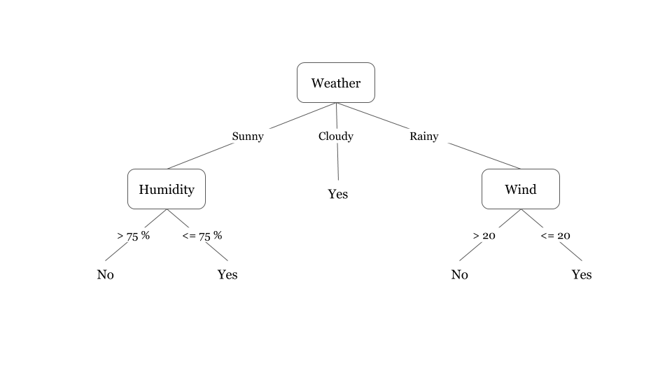
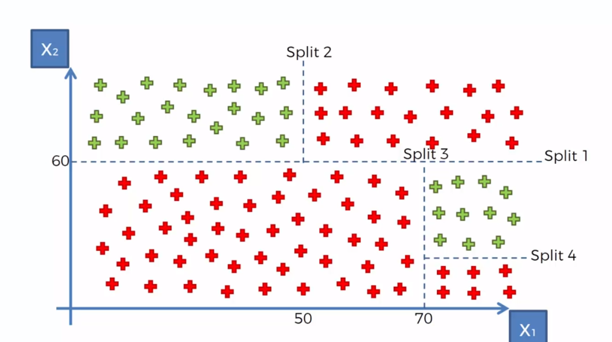
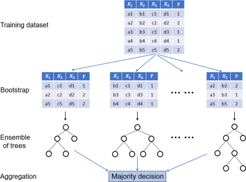

# Árvore de Decisão ou Desion Tree

## Como o algoritmo funciona
Le a base de dados que irá utilizar e constrói uma árvore de decisão com base nas características contidas na base de dados. 
Utiliza a abordagem do dividir para conquistar, pega um problema complexo e quebra em pequenos problemas para chegar a uma conclusão, com isso resultando em uma árvore de decisão.

[Fonte da imagem](https://www.hackerearth.com/practice/machine-learning/machine-learning-algorithms/ml-decision-tree/tutorial/)

Os atributos que estão no topo da árvore são considerados mais importantes do que os que estão no fim da árvore. 
No exemplo acima a variável __weather__ é a mais importante para essa árvore de decisão, em sequência temos as variáveis __humidity__ e __wind__ com mesmo peso em cenários diferentes.

## Como o algoritmo classifica
Com base nas variáveis de entrada, o algoritmo irá percorrer a árvore para chegar a uma classificação.

### Aprendizagem
* __Incremental:__ Atualiza hipótese a cada novo exemplo. 
mais flexível, situada... Porém a ordem de apresentação é importante (backtracking).
* __Não incremental:__ Gerada a partir de todo conjunto de exemplos
Mais eficiente e prática

## Para descobrir quais são os melhores atributos para colocar na árvore de decisão, precisamos usar dois cálculos para tomar essa decisão:

### Entropia
* Mede o quão organizado/desorganizado os atributos estão. 
* Serve como base para o cálculo de ganho de informação.

### Ganho de informação
Ganho de Informação: é uma propriedade estatística que mede quão bem um determinado atributo separa os exemplos de treinamento de acordo com sua classificação de destino 
O ganho de informação será calculado para cada um dos atributos do nosso modelo para que aí sim possamos construir a árvore ordenada do atributo mais importante pro menos importante.

__Exemplo:__  
No curso do udemy queremos classificar o risco de crédito em: alto, moderado e baixo.
As variáveis que temos para poder classificar são: __história de crédito, dívida, garantias e renda atual.__

1. Vamos calcular a entropia da variável risco. Precisamos achar o valor da entropia da nossa variável Y.
2. Vamos calcular a entropia para cada uma das variáveis preditoras do nosso modelo com suas quebras X quebras da nossa variável risco:

|Coluna:      | História de crédito |
|:-----------:|:-------------------:|
|Boa          | Alto                |
|             | Moderado|
|             | Baixo|
|Desconhecida | Alto|
|             | Moderado|
|             | Baixo|
|Ruim         | Alto|
|             | Moderado|
|             | Baixo|

3. Feito esse processo, vamos calcular o ganho de informação para cada um dos atributos: _(história de crédito, dívida, garantias e renda atual)_.
4. Com isso vamos poder chegar a conclusão de qual é o atributo mais importante da nossa árvore.
5. Repetimos todo o processo feito acima para construir os ramos da nossa árvore.
6. Agora vamos utilizar o atributo que foi definido como o principal para filtrar a base e construir os ramos das suas propriedades.

## Uma segunda abordagem no algoritmo de árvore de decisão:

* Criação de splits para encontrar o melhor o melhor conjunto de divisores.

[Fonte](http://diamondclover.com/dtc.html)

## Podas em árvores de decisão:
Após a árvore construída, podemos rever a abordagem  removendo atributos que não tem um peso relevante para a árvore, diminuindo o tamanho da árvore.

BIAS (viés)
* Erros por classificação errada.

Variância
* Erros por sensibilidade pequenas a mudanças na base de treinamento levando a __overfitting__ → Quando o algoritmo de adaptá demais os dados de treinamento.
Geralmente os últimos níveis da árvore são específicos dos dados de treinamento, esse conceito de pode vem para tirar alguns ramos da árvore para tirar esses vieses dos dados de treinamento.

Vantagens
* Fácil interpretação
* Não precisa normalizar ou padronizar.
* Rápido para classificar novos registros

Desvantagens
* Geração de árvores muito complexas.
* Pequenas mudanças nos dados podem mudar a árvore (conceito de poda ajuda aqui).
* Problema NP-completo para construir a árvore.

Observações
* CART - Árvores para Classificação e Regressão 
* O algoritmo de árvore de decisão era muito famoso nos anos 90, hoje em dia os algoritmos de redes neurais, svm e knn tendem a ter desempenho melhores. 
* Florestas randômicas tendem a uma melhor performance que árvores de decisão.

# Florestas Randômicas ou Random Forest
* É uma melhoria no algoritmo de árvores de decisão.
* Ao invés de usar uma única árvore, agora vamos utilizar mais de uma árvore para tomar a decisão (floresta = conjunto de árvores).

[Fonte](https://www.sciencedirect.com/topics/engineering/random-forest)

Ensemble Learning (aprendizagem em conjunto)
* “Consulta vários profissionais para tomar decisão.”
* Ter vários algoritmos juntos para ter um algoritmo mais forte.
* Quando trabalhamos com __regressão__, utilizamos a média
* Quando trabalhamos com __classificação__, utilizamos o votos da maioria das árvores.
* Quanto mais árvores, maior a tendência de overfitting
* É randômico pois utiliza de forma aleatória K atributos para a comparação das métricas de pureza e impureza. (Entropia e impureza de gini)

__Exemplo:__ 
* K = 3 → As árvores terão três atributos.
* Qtd de árvores = 4 → O algoritmo irá criar quatro árvores.
